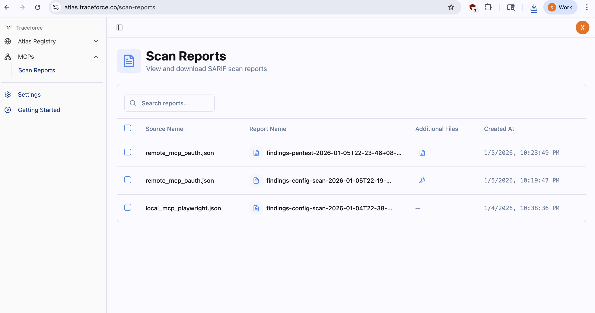

# MCP X-Ray

A comprehensive open-source security scanning and penetration testing solution for Model Context Protocol (MCP) servers. Generates production-ready [SARIF reports](https://sarifweb.azurewebsites.net/) for seamless integration with security tooling and CI/CD pipelines.

## Overview

MCP X-Ray is a unified security scanning and penetration testing solution for MCP servers. It analyzes configurations, detects exposed secrets, identifies unsafe tool definitions, and performs active penetration testing to uncover exploitable vulnerabilities. Scan results can be uploaded to [Traceforce Atlas](https://atlas.traceforce.co) for centralized security management and tracking. Atlas has rated hundreds of MCPs in its registry, providing a comprehensive security assessment database for the MCP ecosystem.

## Features

### Configuration Scanning (`config-scan`)

Analyzes MCP server configurations for security issues before deployment.

- **Connection Security**: Validates TLS certificates, detects unsafe localhost/loopback exposure, and validates OAuth 2.0 configuration (PRM/ASMD)
- **Secrets Detection**: Scans for exposed credentials, API keys, and sensitive information
- **Tool Analysis**: Analyzes tool descriptions using Token Analyzer (default) or LLM Analyzer for risks including arbitrary execution, injection vulnerabilities, authorization bypass, and information disclosure

### Pentest (`pentest`)

Executes security test plans by making actual tool calls against MCP servers. Test plans are LLM-generated based on tool definitions.

**Detection Capabilities:** Code execution, SSRF, path traversal, authorization bypass, input injection, information disclosure, and DoS vulnerabilities

### Repository Scanning (`repo-scan`)

Performs comprehensive security analysis of MCP server codebases before adding to configurations.

- **SCA**: Detects vulnerable dependencies using OSV API
- **SAST**: Identifies unsafe command patterns and security anti-patterns
- **Secrets Detection**: Scans for hardcoded secrets and credentials

### Traceforce Atlas Integration

Upload scan results to [Traceforce Atlas](https://atlas.traceforce.co) for centralized security management, reporting, and tracking over time. See the [Uploading Results to Traceforce](#uploading-results-to-traceforce) section for usage details.



## Installation

### Prerequisites

- [Go 1.25.4 or later](https://go.dev/dl/)

### Build from Source

```bash
# Clone the repository
git clone https://github.com/traceforce/mcp-xray
cd mcp-xray

# Install required dependencies (buf, etc.)
make install-dependencies

# Build everything (generates protobuf code and builds the binary)
# The binary will be created as `mcpxray` in the current directory
make all

```

## Usage

### Configuration Scan

Scan MCP server configurations for security issues:

```bash
# Scan a specific MCP config file (uses token analyzer by default)
./mcpxray config-scan /path/to/mcp/config.json

# Scan all known MCP config paths automatically for Cursor, Claude and Windsurf.
# Known config locations (relative to home directory):
#   ~/.cursor/mcp.json (Cursor)
#   ~/Library/Application Support/Claude/claude_desktop_config.json (Claude Desktop)
#   ~/.codeium/windsurf/mcp_config.json (Windsurf)
./mcpxray config-scan --scan-known-configs

# Use LLM analyzer for more extensive and deepr analysis
./mcpxray config-scan /path/to/mcp/config.json --analyzer-type llm --llm-model claude-3-5-sonnet-20241022

# Specify custom output file
./mcpxray config-scan /path/to/mcp/config.json --output custom-report.sarif.json
```

The configuration scanner will:

1. Connect to MCP servers defined in the configuration file
2. Analyze connection security and exposed secrets in the configuration
2. Discover and analyze available tools from MCP servers
3. Generate SARIF reports with findings for exploitable vulnerabilities

### Pentest

Execute security test plans by making actual tool calls against MCP servers. LLMs are required to run the pentest.

```bash
# Run pentest with auto-generated test plan (requires LLM model)
./mcpxray pentest /path/to/mcp/config.json --llm-model claude-sonnet-4-5

# Use a custom test plan YAML file
./mcpxray pentest /path/to/mcp/config.json --test-plan /path/to/test-plan.yaml --llm-model claude-sonnet-4-5

```

The pentest tool will:
1. Connect to MCP servers defined in the configuration file
2. Generate test plans using LLM (if test-plan is not provided) or load from YAML file
3. Execute test cases by making actual tool calls against the MCP servers
4. Validate responses against expected outputs and detect security vulnerabilities
5. Generate SARIF reports with findings for exploitable vulnerabilities

### Repository Scan

Scan the codebase for security vulnerabilities:

```bash
# Scan current directory
./mcpxray repo-scan

# Scan a specific repository
./mcpxray repo-scan /path/to/repository

# Specify custom output file
./mcpxray repo-scan --output custom-report.sarif.json
```

The repository scanner will:
1. Perform SCA analysis to detect vulnerable dependencies
2. Run SAST analysis to identify unsafe code patterns using YARA rules
3. Scan for hardcoded secrets and credentials in source code

## Output Format

MCP X-Ray generates reports in [SARIF (Static Analysis Results Interchange Format)](https://sarifweb.azurewebsites.net/) format, which is widely supported by security tools and CI/CD platforms.

## Uploading Results to Traceforce

Upload scan results to [Traceforce Atlas](https://atlas.traceforce.co) for centralized security management, reporting, and tracking over time. Add the `--upload` flag to any scan command. Use `--clean-up` to remove generated files after successful upload. Environment variables required:
- `TRACEFORCE_CLIENT_ID`
- `TRACEFORCE_CLIENT_SECRET`

```bash
# Upload config scan results
./mcpxray config-scan /path/to/mcp/config.json --upload

# Upload with cleanup
./mcpxray config-scan /path/to/mcp/config.json --upload --clean-up

# Upload pentest results
./mcpxray pentest /path/to/mcp/config.json --llm-model claude-sonnet-4-5 --upload
```

## Examples

Example scan outputs are available in `examples/findings/`.

Example MCP configuration files are available in the `examples/mcp_configs/` directory.

An example MCP Server is available in the `examples/mcp_server/` directory:
- `mcp_server.py`: FastMCP server using streamable-http transport
- `mcp.json`: Configuration file for connecting to the server
- `README.md`: Instructions for setting up and scanning the server

## Configuration

### Tool Analysis Methods

MCP X-Ray provides two methods for analyzing tool security:

#### Token Analyzer (Default)

The token analyzer uses rule-based pattern matching to quickly detect security issues in tool descriptions. It's fast, doesn't require API keys, and works offline. Token analyzer uses two types of rules:
1. **Token rules** are defined in `internal/configscan/tokenanalyzer/token_rules.yaml`. Each rule specifies:
   - Pattern matching criteria (tokens and phrases)
   - Severity level (low, medium, high, critical)
   - Security category and reason
2. **YARA rules** are defined in `internal/yararules/unsafe_patterns.yar`. These rules detect unsafe system command patterns.

**Usage:**
```bash
mcpxray config-scan --analyzer-type token
```

#### LLM Analyzer

The LLM analyzer uses large language models for deep semantic analysis of tool descriptions, providing more comprehensive security insights.

**Usage:**
```bash
mcpxray config-scan --analyzer-type llm --llm-model <model-name>
```

### Pentest Configuration

By default, the pentest tool uses an LLM to automatically generate test plans based on the available tools from MCP servers. Test plans can also be customized and provided as YAML files. Test plans are YAML files containing test cases with input arguments and expected outputs.

**Default behavior (LLM-generated test plan):**
```bash
./mcpxray pentest /path/to/mcp/config.json --llm-model claude-sonnet-4-5
```

**Custom test plan:**
```bash
./mcpxray pentest /path/to/mcp/config.json --test-plan /path/to/test-plan.yaml --llm-model claude-sonnet-4-5
```

### Supported Models

MCP X-Ray supports the following LLM providers for tool analysis:

#### Anthropic (Claude)
- Examples: `claude-sonnet-4-5`
- Requires: `ANTHROPIC_API_KEY` environment variable

#### OpenAI (GPT)
- Examples: `gpt-5`
- Requires: `OPENAI_API_KEY` environment variable

#### AWS Bedrock (Meta Llama)
- Meta Llama inference profile ARNs starting with `arn:aws:bedrock:` and containing `llama`
- Example: `arn:aws:bedrock:<region>:<account-id>:inference-profile/us.meta.llama3-2-1b-instruct-v1:0`
- Requires: AWS credentials configured via AWS SDK (environment variables, IAM role, or credentials file)

### Environment Variables

For LLM-based tool analysis, configure your LLM API credentials:

#### Anthropic
```bash
export ANTHROPIC_API_KEY=your-api-key
```

#### OpenAI
```bash
export OPENAI_API_KEY=your-api-key
```

Each provider requires its own specific environment variable. The tool automatically detects which provider to use based on the model name.

#### AWS Bedrock
For AWS Bedrock models, configure AWS credentials using one of the standard AWS SDK methods:

```bash
# Option 1: Environment variables
export AWS_ACCESS_KEY_ID=your-access-key
export AWS_SECRET_ACCESS_KEY=your-secret-key
export AWS_REGION=us-east-1

# Option 2: AWS credentials file (~/.aws/credentials)
# Option 3: IAM role (when running on EC2/ECS/Lambda)
```

MCP X-Ray uses AWS SDK that will automatically load credentials from the environment, credentials file, or IAM role.

## Contributing

Contributions are welcome! Please ensure that:

1. Code follows Go best practices
2. Tests and examples are included for new features
3. Documentation is updated

## References

- [Model Context Protocol (MCP)](https://modelcontextprotocol.io/)
- [SARIF Specification](https://sarifweb.azurewebsites.net/)
- [OSV Scanner](https://google.github.io/osv-scanner/)
- [Gitleaks](https://github.com/gitleaks/gitleaks)
