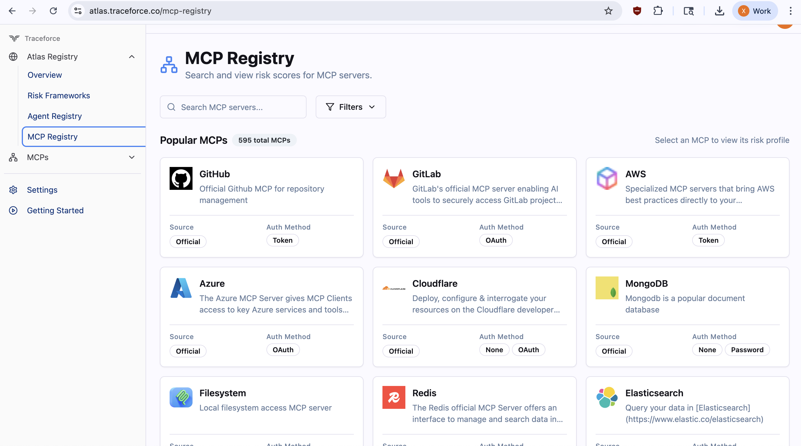
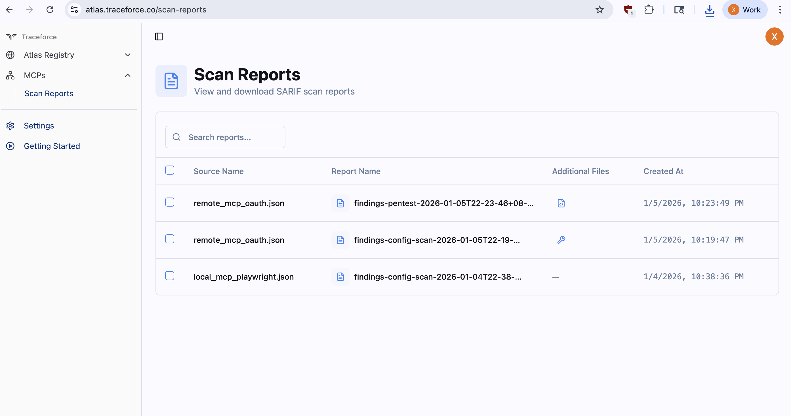

# MCP X-Ray

## Overview

MCP X-Ray is a unified open-source security scanning and penetration testing solution for Model Context Protocol (MCP) servers. It generates production-ready [SARIF reports](https://sarifweb.azurewebsites.net/) for seamless integration with security tooling and CI/CD pipelines. Scan results can be optionally uploaded to [Traceforce Atlas](https://atlas.traceforce.co) for centralized security management and tracking. Atlas has over 600 MCPs in its registry, providing a comprehensive security assessment database for the MCP ecosystem.



## Installation

### Prerequisites

- [Go 1.25.4 or later](https://go.dev/dl/)

### Build from Source

```bash
# Clone the repository
git clone https://github.com/traceforce/mcp-xray
cd mcp-xray

# Install required dependencies (buf, etc.)
make install-dependencies

# Build everything (generates protobuf code and builds the binary)
# The binary will be created as `mcpxray` in the current directory
make all

# Install to /usr/local/bin
sudo make install
```

## Usage

### Configuration Scan (`config-scan`)

Scan MCP configs for security issues. Run before `pentest` to baseline your setup.

**Detection Capabilities:**

- **Connection Security**: Validates TLS certificates, detects unsafe localhost/loopback exposure, and validates OAuth 2.0 configuration (PRM/ASMD)
- **Secrets Detection**: Scans for exposed credentials, API keys, and sensitive information
- **Tool Analysis**: Analyzes tool descriptions using Token Analyzer (default) or LLM Analyzer for risks including arbitrary execution, injection vulnerabilities, authorization bypass, and information disclosure

**Supported Command Line Arguments**

| Flag | Type | Default Value | Description |
| :--- | :--- | :--- | :--- |
| `--output` / `-o` | `string` | `findings-config-scan-<timestamp>.sarif.json` | SARIF report output path |
| `--tools-output` | `string` | `tools_summary_<ts>.json` | Tools JSON output path |
| `--analyzer-type` | `string` | `token` | Supported types are `token` or `llm` |
| `--llm-model` | `string` | N/A | LLM model (required if analyzer is `llm`) |
| `--llm-max-retries` | `int` | `3` | Max retries on transient LLM errors |
| `--scan-known-configs` | `bool` | `false` | Scan all known MCP config paths |
| `--upload` | `bool` | `false` | Upload SARIF to Traceforce Atlas |
| `--clean-up` | `bool` | `false` | Remove generated files after upload |
| `--output-dir` | `string` | N/A | Directory for all output files (default: current working directory) |

**Example Usage**

1. Scan a specific MCP config file (uses token analyzer by default):
```bash
mcpxray config-scan /path/to/mcp/config.json
```

2. Scan all known MCP config paths automatically for Cursor, Claude and Windsurf.
Known config locations (relative to home directory):
* `~/.cursor/mcp.json` (Cursor)
* `~/Library/Application Support/Claude/claude_desktop_config.json` (Claude Desktop)
* `~/.codeium/windsurf/mcp_config.json` (Windsurf)
```bash
mcpxray config-scan --scan-known-configs
```

3. Use LLM analyzer for more extensive and deeper analysis
```bash
mcpxray config-scan /path/to/mcp/config.json --analyzer-type llm --llm-model claude-3-5-sonnet-20241022
```

4. Specify custom output file
```bash
mcpxray config-scan /path/to/mcp/config.json --output custom-report.sarif.json
```

### Penetration Testing (`pentest`)

Execute security test plans by making actual tool calls against MCP servers. LLMs are required to run the pentest. Run this before actual deployment in production.

**Detection Capabilities:**
- Code execution
- SSRF
- Path Traversal
- Authorization Bypass
- Input Injection
- Information Disclosure
- DoS Vulnerabilities

**Supported Command Line Arguments**

| Flag | Type | Default Value | Description |
| :--- | :--- | :--- | :--- |
| `--llm-model` | `string` | N/A | LLM model (required) |
| `--llm-max-retries` | `int` | `3` | Max retries on transient LLM errors |
| `--test-plan` | `string` | N/A | Path to test plan YAML |
| `--test-directory` | `string` | `pentest_plans_<ts>` | Directory for generated test plans |
| `--output` / `-o` | `string` | `findings-pentest-<timestamp>.sarif.json` | SARIF report output path |
| `--upload` | `bool` | `false` | Upload SARIF to Traceforce Atlas |
| `--clean-up` | `bool` | `false` | Remove files after upload |
| `--output-dir` | `string` | N/A | Directory for all output files (default: current working directory) |

**Example Usage**

1. Run pentest with auto-generated test plan (requires LLM model)
```bash
mcpxray pentest /path/to/mcp/config.json --llm-model claude-sonnet-4-5
```

2. Use a custom test plan YAML file
```bash
mcpxray pentest /path/to/mcp/config.json --test-plan /path/to/test-plan.yaml --llm-model claude-sonnet-4-5
```

### Repository Scan (`repo-scan`)

Scan the codebase for vulnerabilities; use when you own or can change the code.

**Detection Capabilities:**
- **SCA**: Detects vulnerable dependencies using OSV API
- **SAST**: Identifies unsafe command patterns and security anti-patterns
- **Secrets Detection**: Scans for hardcoded secrets and credentials

**Supported Command Line Arguments**

| Flag | Type | Default Value | Description |
| :--- | :--- | :--- | :--- |
| `--output` / `-o` | `string` | `findings-repo-scan-<timestamp>.sarif.json` | SARIF report output path |
| `--max-file-size` | `int64` | `0 (→10MB)` | Max file size to scan |
| `--exclude-paths` / `-e` | `string[]` | N/A | Path patterns to exclude |
| `--use-default-excludes` | `bool` | `true` | Exclude `node_modules`, `.git`, etc. |
| `--cve` | `bool` | `false` | Run CVE/SCA scan |
| `--secrets` | `bool` | `false` | Run secrets scan |
| `--sast` | `bool` | `false` | Run SAST scan |
| `--upload` | `bool` | `false` | Upload SARIF to Traceforce Atlas |
| `--clean-up` | `bool` | `false` | Remove files after upload |
| `--output-dir` | `string` | N/A | Directory for all output files (default: current working directory) |

**Example Usage**

1. Scan current directory
```bash
mcpxray repo-scan
```

2. Scan a specific repository
```bash
mcpxray repo-scan /path/to/repository
```

3. Specify custom output file
```bash
mcpxray repo-scan --output custom-report.sarif.json
```

### Verification (`verify`)

Post-process step to verify results from a previous scan.

**Supported Command Line Arguments**

| Flag | Type | Default Value | Description |
| :--- | :--- | :--- | :--- |
| `--sarif` | `string` | N/A | Path to SARIF file (required) |
| `--llm-model` | `string` | N/A | LLM model (required) |
| `--llm-max-retries` | `int` | `3` | Max retries on transient LLM errors |
| `--output` / `-o` | `string` | `findings-verify-<timestamp>.sarif.json` | SARIF report output path |
| `--upload` | `bool` | `false` | Upload SARIF to Traceforce Atlas |
| `--clean-up` | `bool` | `false` | Remove files after upload |
| `--output-dir` | `string` | N/A | Directory for all output files (default: current working directory) |

**Example Usage**

1. Verify the findings of previously run test
```bash
mcpxray verify --sarif custom-report.sarif.json --llm-model claude-3-5-sonnet-20241022
```

## Output Format

MCP X-Ray generates reports in [SARIF (Static Analysis Results Interchange Format)](https://sarifweb.azurewebsites.net/) format, which is widely supported by security tools and CI/CD platforms.

## Uploading Results to Traceforce

Upload scan results to [Traceforce Atlas](https://atlas.traceforce.co) for centralized security management, reporting, and tracking over time. Add the `--upload` flag to any scan command. Use `--clean-up` to remove generated files after successful upload.

Environment variables required:
- `TRACEFORCE_CLIENT_ID`
- `TRACEFORCE_CLIENT_SECRET`

These credentials can be downloaded from the settings page on the Atlas UI.

```bash
# Upload config scan results
mcpxray config-scan /path/to/mcp/config.json --upload

# Upload with cleanup
mcpxray config-scan /path/xia-add-registry-imageto/mcp/config.json --upload --clean-up

# Upload pentest results
mcpxray pentest /path/to/mcp/config.json --llm-model claude-sonnet-4-5 --upload
```


## Examples

Example scan outputs are available in `examples/findings/`.

Example MCP configuration files are available in the `examples/mcp_configs/` directory.

An example MCP Server is available in the `examples/mcp_server/` directory:
- `mcp_server.py`: [FastMCP](https://github.com/jlowin/fastmcp) server using streamable-http transport
- `mcp.json`: Configuration file for connecting to the server
- `README.md`: Instructions for setting up and scanning the server


## Configuration

### Tool Analysis Methods

MCP X-Ray provides two methods for analyzing tool security:

#### Token Analyzer (Default)

The token analyzer uses rule-based pattern matching to quickly detect security issues in tool descriptions. It's fast, doesn't require API keys, and works offline. Token analyzer uses two types of rules:
1. **Token rules** are defined in `internal/configscan/tokenanalyzer/token_rules.yaml`. Each rule specifies:
   - Pattern matching criteria (tokens and phrases)
   - Severity level (low, medium, high, critical)
   - Security category and reason
2. **YARA rules** are defined in `internal/yararules/unsafe_patterns.yar`. These rules detect unsafe system command patterns.

**Usage:**
```bash
mcpxray config-scan --analyzer-type token
```

#### LLM Analyzer

The LLM analyzer uses large language models for deep semantic analysis of tool descriptions, providing more comprehensive security insights.

**Usage:**
```bash
mcpxray config-scan --analyzer-type llm --llm-model <model-name>
```

### Pentest Configuration

By default, the pentest tool uses an LLM to automatically generate test plans based on the available tools from MCP servers. Test plans can also be customized and provided as YAML files. Test plans are YAML files containing test cases with input arguments and expected outputs.

**Default behavior (LLM-generated test plan):**
```bash
mcpxray pentest /path/to/mcp/config.json --llm-model claude-sonnet-4-5
```

**Custom test plan:**
```bash
mcpxray pentest /path/to/mcp/config.json --test-plan /path/to/test-plan.yaml --llm-model claude-sonnet-4-5
```

### Supported Models

MCP X-Ray supports the following LLM providers for tool analysis:

#### Anthropic (Claude)
- Examples: `claude-sonnet-4-5`
- Requires: `ANTHROPIC_API_KEY` environment variable

#### OpenAI (GPT)
- Examples: `gpt-5`
- Requires: `OPENAI_API_KEY` environment variable

#### AWS Bedrock (Meta Llama)
- Meta Llama inference profile ARNs starting with `arn:aws:bedrock:` and containing `llama`
- Example: `arn:aws:bedrock:<region>:<account-id>:inference-profile/us.meta.llama3-2-1b-instruct-v1:0`
- Requires: AWS credentials configured via AWS SDK (environment variables, IAM role, or credentials file)

### Environment Variables

For LLM-based tool analysis, configure your LLM API credentials:

#### Anthropic
```bash
export ANTHROPIC_API_KEY=your-api-key
```

#### OpenAI
```bash
export OPENAI_API_KEY=your-api-key
```

Each provider requires its own specific environment variable. The tool automatically detects which provider to use based on the model name.

#### AWS Bedrock
For AWS Bedrock models, configure AWS credentials using one of the standard AWS SDK methods:

```bash
# Option 1: Environment variables
export AWS_ACCESS_KEY_ID=your-access-key
export AWS_SECRET_ACCESS_KEY=your-secret-key
export AWS_REGION=us-east-1

# Option 2: AWS credentials file (~/.aws/credentials)
# Option 3: IAM role (when running on EC2/ECS/Lambda)
```

MCP X-Ray uses AWS SDK that will automatically load credentials from the environment, credentials file, or IAM role.

## Contributing

Contributions are welcome! Please ensure that:

1. Code follows Go best practices
2. Tests and examples are included for new features
3. Documentation is updated

## References

- [Model Context Protocol (MCP)](https://modelcontextprotocol.io/)
- [SARIF Specification](https://sarifweb.azurewebsites.net/)
- [OSV Scanner](https://google.github.io/osv-scanner/)
- [Gitleaks](https://github.com/gitleaks/gitleaks)
