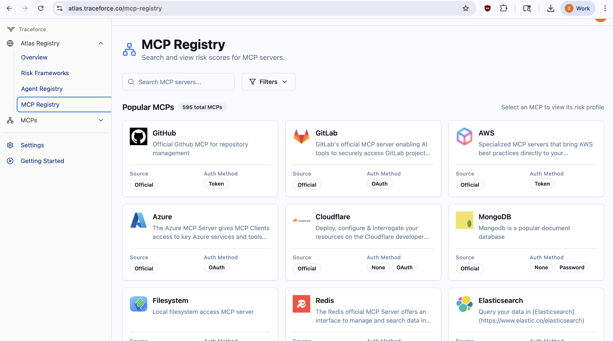
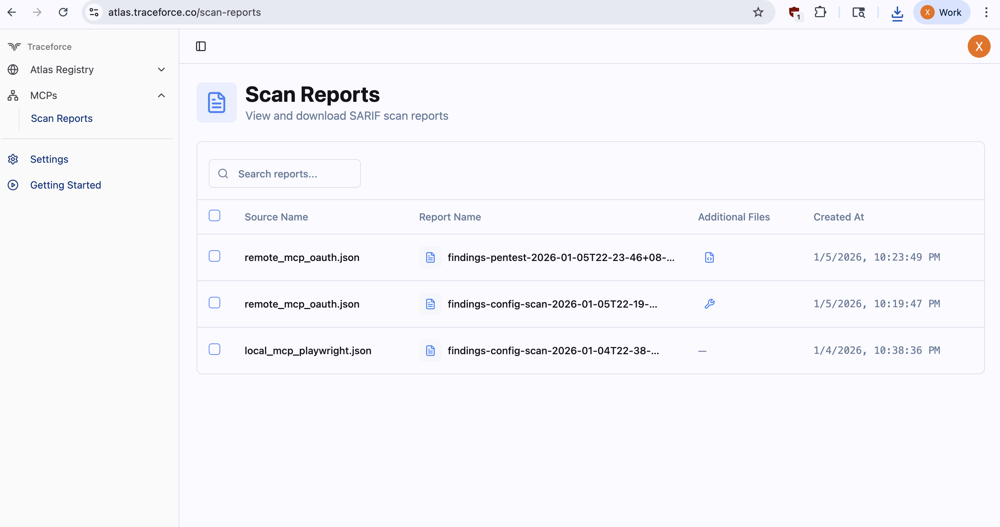

# MCP X-Ray

## Overview

MCP X-Ray is a unified open-source security scanning and penetration testing solution for Model Context Protocol (MCP) servers. It generates production-ready [SARIF reports](https://sarifweb.azurewebsites.net/) for seamless integration with security tooling and CI/CD pipelines. Scan results can be optionally uploaded to [Traceforce Atlas](https://atlas.traceforce.co) for centralized security management and tracking. Atlas has over 600 MCPs in its registry, providing a comprehensive security assessment database for the MCP ecosystem.



## Installation

### Prerequisites

- [Go 1.25.4 or later](https://go.dev/dl/)

### Build from Source

```bash
# Clone the repository
git clone https://github.com/traceforce/mcp-xray
cd mcp-xray

# Install required dependencies (buf, etc.)
make install-dependencies

# Build everything (generates protobuf code and builds the binary)
# The binary will be created as `mcpxray` in the current directory
make all

```

## Usage

### Configuration Scan

Scan MCP configs for security issues; run before pentest to baseline your setup.

```bash
# Scan a specific MCP config file (uses token analyzer by default)
./mcpxray config-scan /path/to/mcp/config.json

# Scan all known MCP config paths automatically for Cursor, Claude and Windsurf.
# Known config locations (relative to home directory):
#   ~/.cursor/mcp.json (Cursor)
#   ~/Library/Application Support/Claude/claude_desktop_config.json (Claude Desktop)
#   ~/.codeium/windsurf/mcp_config.json (Windsurf)
./mcpxray config-scan --scan-known-configs

# Use LLM analyzer for more extensive and deepr analysis
./mcpxray config-scan /path/to/mcp/config.json --analyzer-type llm --llm-model claude-3-5-sonnet-20241022

# Specify custom output file
./mcpxray config-scan /path/to/mcp/config.json --output custom-report.sarif.json
```

**Detection Capabilities:**

- **Connection Security**: Validates TLS certificates, detects unsafe localhost/loopback exposure, and validates OAuth 2.0 configuration (PRM/ASMD)
- **Secrets Detection**: Scans for exposed credentials, API keys, and sensitive information
- **Tool Analysis**: Analyzes tool descriptions using Token Analyzer (default) or LLM Analyzer for risks including arbitrary execution, injection vulnerabilities, authorization bypass, and information disclosure

### Pentest

Execute security test plans by making actual tool calls against MCP servers. LLMs are required to run the pentest. Run this before actual deployment in production.

```bash
# Run pentest with auto-generated test plan (requires LLM model)
./mcpxray pentest /path/to/mcp/config.json --llm-model claude-sonnet-4-5

# Use a custom test plan YAML file
./mcpxray pentest /path/to/mcp/config.json --test-plan /path/to/test-plan.yaml --llm-model claude-sonnet-4-5

```
**Detection Capabilities:** Code execution, SSRF, path traversal, authorization bypass, input injection, information disclosure, and DoS vulnerabilities

### Repository Scan

Scan the codebase for vulnerabilities; use when you own or can change the code.

```bash
# Scan current directory
./mcpxray repo-scan

# Scan a specific repository
./mcpxray repo-scan /path/to/repository

# Specify custom output file
./mcpxray repo-scan --output custom-report.sarif.json
```
**Detection Capabilities:**
- **SCA**: Detects vulnerable dependencies using OSV API
- **SAST**: Taint analysis that traces MCP tool/handler inputs (sources) to dangerous
  sinks — command injection, code injection, path traversal, SSRF, and SQL injection —
  plus the existing unsafe-command pattern rules
- **Secrets Detection**: Scans for hardcoded secrets and credentials

The taint SAST uses the [OpenGrep](https://github.com/opengrep/opengrep) engine. Install
the pinned, SHA-verified binary with `make install-opengrep` (Linux x86_64/arm64, macOS
arm64/x86_64, Windows x86_64 under git-bash). On other platforms, install `opengrep`
yourself and set `MCPXRAY_OPENGREP_BIN`. Taint analysis activates by installation:
`repo-scan` runs it whenever the pinned engine is resolvable, and when the engine is
absent it skips taint and still runs SCA, secrets, and the unsafe-command rules.

For cross-file, interprocedural taint on Go and TypeScript (and Python), install the CodeQL
engine. It activates by installation too, and its findings are merged with OpenGrep's:

```bash
make install-codeql                        # pinned CodeQL bundle (Linux x86_64, macOS, Windows)
./mcpxray repo-scan <repo>                 # every installed engine runs; results merged
```

CodeQL builds a database per language, so a scan takes noticeably longer once the bundle is
installed; that cost is the price of cross-file analysis. To drop back to the fast intra-file
pass, uninstall the engine the way you installed it: remove the bundle from `make install-codeql`
(it lives next to the binary), or unset `MCPXRAY_CODEQL_BIN` if you pointed it at one. Python and
TypeScript extract build-free (the target is never executed). Go has no build-free mode, so CodeQL
compiles the target; that step runs only with `--codeql-allow-build` and is otherwise skipped with
a warning; the scan never blocks on a prompt.

Each language gets a time budget covering `database create` plus `analyze` — 600s by default.
A target that exceeds it contributes nothing, so raise it for large repositories with
`--codeql-timeout <seconds>` (or `MCPXRAY_CODEQL_TIMEOUT`); the flag wins when both are set.
Exceeding the budget is reported as `timed out after Ns`, never as a clean zero.

#### Monorepo / Target Resolution

By default, `repo-scan` treats the whole repository path as the scan boundary. For a monorepo containing multiple independent MCP servers, or one server mixed in with unrelated clients/SDKs/shared libraries, that can mean unrelated findings (scanning the root) or missed shared components (scanning one directory by hand). `--target-resolution` detects the MCP server(s) actually present and scopes the scan to the selected one plus the shared components it depends on.

```bash
# Detect MCP server targets in the repository and print them, without scanning
./mcpxray repo-scan /path/to/monorepo --list-targets

# Scan a specific detected target by name
./mcpxray repo-scan /path/to/monorepo --target-resolution --target "Fabric MCP"

# If there's exactly one detected target, it's selected automatically
./mcpxray repo-scan /path/to/monorepo --target-resolution
```

If more than one target is found and `--target` isn't given, `repo-scan` prompts interactively when run from a terminal, or exits with the list of discovered targets (and the exact `--target` value to pass) when run non-interactively, e.g. in CI. A plain `repo-scan` (no target-resolution flags at all) still scans the whole repository exactly as before, but if it detects two or more possible targets it prints a one-line notice pointing at `--target-resolution --list-targets` so a monorepo isn't scanned as one flat unit by accident.

This is opt-in: without `--target-resolution` (or `--list-targets`), `repo-scan` behaves exactly as before. Target detection covers Go, Node/npm (including `workspace:`/`file:`/`link:` protocol dependencies), Python (Poetry and `uv` workspace path/source dependencies), .NET (`ProjectReference`), Java (Maven `pom.xml` modules), and Rust (Cargo workspaces) projects.

## Output Format

MCP X-Ray generates reports in [SARIF (Static Analysis Results Interchange Format)](https://sarifweb.azurewebsites.net/) format, which is widely supported by security tools and CI/CD platforms.

## Uploading Results to Traceforce

Upload scan results to [Traceforce Atlas](https://atlas.traceforce.co) for centralized security management, reporting, and tracking over time. Add the `--upload` flag to any scan command. Use `--clean-up` to remove generated files after successful upload.

Environment variables required:
- `TRACEFORCE_CLIENT_ID`
- `TRACEFORCE_CLIENT_SECRET`

These credentials can be downloaded from the settings page on the Atlas UI.

```bash
# Upload config scan results
./mcpxray config-scan /path/to/mcp/config.json --upload

# Upload with cleanup
./mcpxray config-scan /path/xia-add-registry-imageto/mcp/config.json --upload --clean-up

# Upload pentest results
./mcpxray pentest /path/to/mcp/config.json --llm-model claude-sonnet-4-5 --upload
```


## Examples

Example scan outputs are available in `examples/findings/`.

Example MCP configuration files are available in the `examples/mcp_configs/` directory.

An example MCP Server is available in the `examples/mcp_server/` directory:
- `mcp_server.py`: [FastMCP](https://github.com/jlowin/fastmcp) server using streamable-http transport
- `mcp.json`: Configuration file for connecting to the server
- `README.md`: Instructions for setting up and scanning the server


## Configuration

### Tool Analysis Methods

MCP X-Ray provides two methods for analyzing tool security:

#### Token Analyzer (Default)

The token analyzer uses rule-based pattern matching to quickly detect security issues in tool descriptions. It's fast, doesn't require API keys, and works offline. Token analyzer uses two types of rules:
1. **Token rules** are defined in `internal/configscan/tokenanalyzer/token_rules.yaml`. Each rule specifies:
   - Pattern matching criteria (tokens and phrases)
   - Severity level (low, medium, high, critical)
   - Security category and reason
2. **YARA rules** are defined in `internal/yararules/unsafe_patterns.yar`. These rules detect unsafe system command patterns.

**Usage:**
```bash
mcpxray config-scan --analyzer-type token
```

#### LLM Analyzer

The LLM analyzer uses large language models for deep semantic analysis of tool descriptions, providing more comprehensive security insights.

**Usage:**
```bash
mcpxray config-scan --analyzer-type llm --llm-model <model-name>
```

### Pentest Configuration

By default, the pentest tool uses an LLM to automatically generate test plans based on the available tools from MCP servers. Test plans can also be customized and provided as YAML files. Test plans are YAML files containing test cases with input arguments and expected outputs.

**Default behavior (LLM-generated test plan):**
```bash
./mcpxray pentest /path/to/mcp/config.json --llm-model claude-sonnet-4-5
```

**Custom test plan:**
```bash
./mcpxray pentest /path/to/mcp/config.json --test-plan /path/to/test-plan.yaml --llm-model claude-sonnet-4-5
```

### Supported Models

MCP X-Ray supports the following LLM providers for tool analysis:

#### Anthropic (Claude)
- Examples: `claude-sonnet-4-5`
- Requires: `ANTHROPIC_API_KEY` environment variable

#### OpenAI (GPT)
- Examples: `gpt-5`
- Requires: `OPENAI_API_KEY` environment variable

#### AWS Bedrock (Meta Llama)
- Meta Llama inference profile ARNs starting with `arn:aws:bedrock:` and containing `llama`
- Example: `arn:aws:bedrock:<region>:<account-id>:inference-profile/us.meta.llama3-2-1b-instruct-v1:0`
- Requires: AWS credentials configured via AWS SDK (environment variables, IAM role, or credentials file)

### Environment Variables

For LLM-based tool analysis, configure your LLM API credentials:

#### Anthropic
```bash
export ANTHROPIC_API_KEY=your-api-key
```

#### OpenAI
```bash
export OPENAI_API_KEY=your-api-key
```

Each provider requires its own specific environment variable. The tool automatically detects which provider to use based on the model name.

#### AWS Bedrock
For AWS Bedrock models, configure AWS credentials using one of the standard AWS SDK methods:

```bash
# Option 1: Environment variables
export AWS_ACCESS_KEY_ID=your-access-key
export AWS_SECRET_ACCESS_KEY=your-secret-key
export AWS_REGION=us-east-1

# Option 2: AWS credentials file (~/.aws/credentials)
# Option 3: IAM role (when running on EC2/ECS/Lambda)
```

MCP X-Ray uses AWS SDK that will automatically load credentials from the environment, credentials file, or IAM role.

## Contributing

Contributions are welcome! Please ensure that:

1. Code follows Go best practices
2. Tests and examples are included for new features
3. Documentation is updated

## References

- [Model Context Protocol (MCP)](https://modelcontextprotocol.io/)
- [SARIF Specification](https://sarifweb.azurewebsites.net/)
- [OSV Scanner](https://google.github.io/osv-scanner/)
- [Gitleaks](https://github.com/gitleaks/gitleaks)
